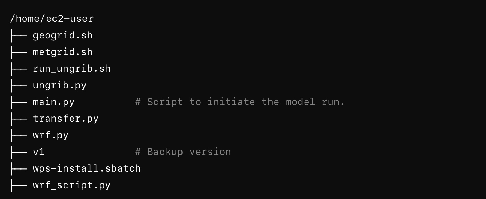

# Introduction to Using WRFExpress for Running WRF on AWS

`WRFExpress` is designed to streamline the process of running Weather Research and Forecasting (WRF) models on AWS clusters. This tool simplifies complex configurations and automates various steps, making it accessible even to those without deep technical expertise. Here’s how you can utilize WRFExpress to get started with your WRF simulations.

## Website Interface

The web interface of WRFExpress allows you to easily define your simulation domain by selecting an area on an interactive map. Here’s a step-by-step guide on how to use it:

<ol>
   <li>Access the Website: Navigate to the <a href="https://wrfexpress.com" target="_blank">WRFExpress website</a> and log in with your credentials.</li>
   <li>Select a Domain: Use the interactive map to draw rectangles defining your simulation domains. You can create multiple nested domains by drawing new rectangles within existing ones.</li>
   <li>Configuration Settings: On the right side of the screen, fill in the necessary configuration details:</li>
   <ul>
      <li><b>Orcid ID</b>: Enter your ORCID ID.</li>
      <li><b>API Token</b>: Provide your API token.</li>
      <li><b>Start Date and End Date</b>: Specify the start and end dates for your simulation period.</li>
      <li><b>Time Interval</b>: Set the time interval for data points (e.g., 6 hours).</li>
      <li><b>DX and DY</b>: Specify the grid spacing for your simulation.</li>
   </ul>
  <li>Update Configuration: After filling in the details, click on "Update Configuration" to save your settings.</li>
  <li>Generate Namelist: Click on "Generate Namelist" to create the <code>namelist.wps</code> file, which is essential for running WRF.</li>
  <li>Generate Download Data Code: Click on "Generate Download Data Code" to get the Python script for downloading necessary data files.</li>
</ol>

## Running WRF on AWS Cluster

After configuring your simulation domain and generating necessary files, follow these steps to run WRF on the AWS cluster:

1. Go to [WRFExpress.com](https://wrfexpress.com) and log in.
2. After entering the necessary info and clicking on the ”Update Configuration” button, copy the namelist text by clicking on the “Generate Namelist” and “Copy to Clipboard” buttons.
3. On [AWS Parallel Cluster WRF-P2](https://pcui-auth-3de65d10-76cb-11ee-9cab-02f64d93270f.auth.us-east-2.amazoncognito.com/login?response_type=code&client_id=6hl2fttmbkt04ck3iq353ona9d&scope=openid&redirect_uri=https://x6ekiatuyb.execute-api.us-east-2.amazonaws.com/login&state=563j3c0he2fgb), paste the copied namelist in the terminal and press Enter.
4. On WRFExpress, click “Generate Download Data Code” and copy the info by clicking the “Copy to Clipboard” button at the bottom.
5. Paste the text in the WRF-P2 terminal and press enter.

6. Run the command: `python3 main.py`
7. Choose 1 for ”Enter the step number.”
8. Choose 1 for the node number.
9. Choose 2 for the tasks per node.
10. Choose ”Hourly” for the NC file output resolution.
11. Wait for the run to complete.
12. You can check the progress by opening another shell and typing `squeue` in the terminal. You can see the progress when the model has started running.
13. Note that if you need to rerun the model using the same config, you can call main.py again and choose step 4.
14. When the run is complete, you can see the data on the WRFExpress website after refreshing the screen.
15. Download the data by selecting the file, files are named with the time (e.g., 2019-07-23 _16-05-18) when the run was complete, clicking the “Copy AWS Commands” and pasting the code in the terminal.

<ol>
        <li>Go to <a href="https://wrfexpress.com" target="_blank">WRFExpress.com</a> and log in.</li>
        <li>After entering the necessary info and clicking on the "Update Configuration" button, copy the namelist text by clicking on the "Generate Namelist" and "Copy to Clipboard" buttons.</li>
        <li>On <a href="https://pcui-auth-3de65d10-76cb-11ee-9cab-02f64d93270f.auth.us-east-2.amazoncognito.com/login?response_type=code&client_id=6hl2fttmbkt04ck3iq353ona9d&scope=openid&redirect_uri=https://x6ekiatuyb.execute-api.us-east-2.amazonaws.com/login&state=563j3c0he2fgb" target="_blank">AWS Parallel Cluster WRF-P2</a>, paste the copied namelist in the terminal and press Enter.</li>
        <li>On WRFExpress, click "Generate Download Data Code" and copy the info by clicking the "Copy to Clipboard" button at the bottom.</li>
        <li>Paste the text in the WRF-P2 terminal and press enter.</li>
    </ol>

    

        
        <figcaption>Directory structure of the WRF model setup on AWS.</figcaption>
    

    <ol start="6">
        <li>Run the command: <code>python3 main.py</code></li>
        <li>Choose 1 for ”Enter the step number.”</li>
        <li>Choose 1 for the node number.</li>
        <li>Choose 2 for the tasks per node.</li>
        <li>Choose ”Hourly” for the NC file output resolution.</li>
        <li>Wait for the run to complete.</li>
        <li>You can check the progress by opening another shell and typing <code>squeue</code> in the terminal. You can see the progress when the model has started running.</li>
        <li>Note that if you need to rerun the model using the same config, you can call <code>main.py</code> again and choose step 4.</li>
        <li>When the run is complete, you can see the data on the WRFExpress website after refreshing the screen.</li>
        <li>Download the data by selecting the file, files are named with the time (e.g., 2019-07-23 _16-05-18) when the run was complete, clicking the "Copy AWS Commands" and pasting the code in the terminal.</li>
    </ol>

## Key Features of the Python Script

- Shell Command Execution: Automates the execution of multiple WRF-related shell scripts.
- S3 Integration: Uploads simulation outputs to an S3 bucket and generates a presigned URL for easy download.
- Progress Monitoring: Uses the `rich` library to display real-time progress of script execution and job queue status.
- Error Handling: Provides informative logs for troubleshooting any issues that arise during execution.

By following these steps, WRFExpress simplifies the setup and execution of WRF simulations on AWS, allowing users to focus more on their research and less on the technical complexities of the modeling process.
