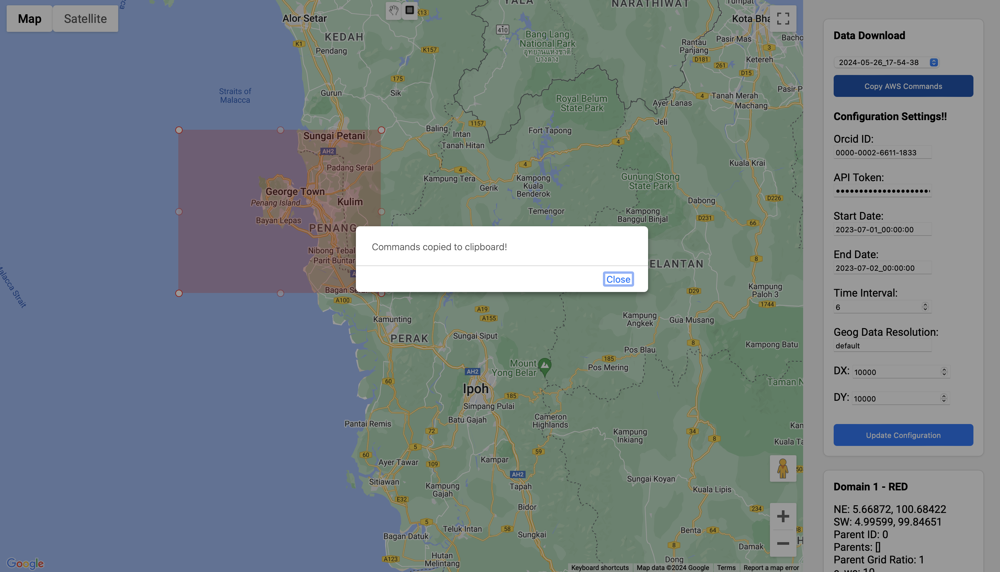

# User Guide for Website Environment

## Overview
This guide provides detailed step-by-step instructions on how to use the website for generating namelist files and downloading GFS data. By following these steps, users can efficiently set up their environment, configure their data, and prepare necessary files for their projects.

## Step 1: Setting Up the Environment

- Upon accessing the website, users will see an interactive map interface. This map is used to define the area of interest for data configuration.
- Users need to click on the square icon located at the top of the page. This icon allows you to draw a rectangular selection on the map.
- To draw a square, click and hold the mouse button on the map, then drag to create the desired area. Release the mouse button to complete the selection.
- Alternatively, users can use the hand tool to resize the square by clicking on the edges or corners of the drawn area and dragging to adjust the size. The map can also be moved by clicking and dragging the map itself.

## Step 2: Choosing the Grid Ratio

- After drawing the desired area on the map, a prompt will appear asking for the grid ratio.
- The grid ratio defines the resolution of the grid for the selected area. For accurate data configuration, the first grid ratio should always be set to 1.
- Enter the value `1` in the prompt and click `OK` to confirm.
- This step ensures that the base grid is set correctly, which is essential for subsequent configurations.

## Step 3: Generating the Namelist

- Users can generate a namelist file by clicking on the "Generate Namelist" button located in the "Data Download" section.
- The website will automatically generate the namelist file based on the selected area and grid ratio.
- Once generated, the namelist file content will be displayed in a popup window.
- Copy the generated namelist by clicking the "Copy to Clipboard" button.
- Paste the copied namelist into the appropriate location on your cluster. This file is essential for running WRF models as it contains configuration settings.

## Step 4: Downloading GFS Files

- Similar to generating the namelist, users can download GFS files by clicking on the relevant button in the "Data Download" section.
- The website will generate Python code required to download the GFS data files.
- This code will be displayed in a popup window.
- Copy the provided Python code by clicking the "Copy to Clipboard" button.
- Paste the copied code into your Python environment or script to download the necessary GFS data files.
- Ensure that you have the required permissions and internet access to download the data from the specified URLs.

## Step 5: Confirmation of Copied Files

- After copying the namelist and GFS Python code, a confirmation message will appear.
- This message indicates that the files have been successfully copied and are ready to use.
- The confirmation ensures that users can proceed with their workflow, knowing that the necessary files are prepared for the next steps.
- Users should verify that the copied files are correctly placed in their designated locations on the cluster or local environment.

## Step 6: Downloading Data from S3

- To download the data from S3, users can view the list of available datasets stored on Amazon S3.
- On the right-hand side of the interface, there is a "Data Download" section that lists available datasets.
- Scroll through the list and select the required dataset by clicking on it. The selection will highlight the chosen dataset.
- Once a dataset is selected, the website will generate a temporary access key.
- This temporary access key can be used to download the data directly from the S3 bucket using a Linux or Mac terminal.
- Copy the provided access key and use it with commands like `aws s3 cp` to download the entire folder containing the dataset.
- This step allows users to easily transfer data from the cloud to their local or cluster environment for further processing.

By following these detailed steps, users can efficiently navigate the website, configure their data, and prepare the necessary files for their meteorological and environmental projects.
